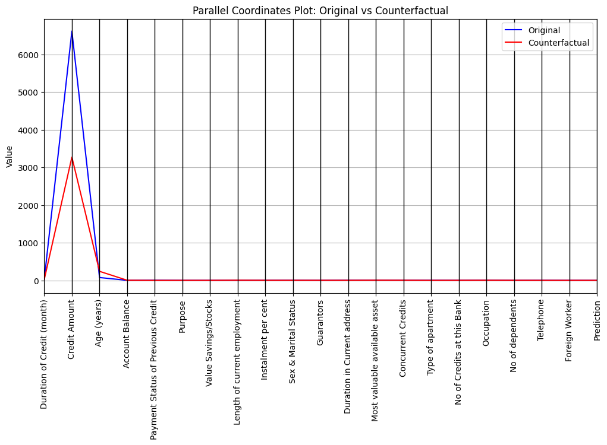

# 🔍 German Credit Risk Analysis with Explainable Deep Learning

This project demonstrates the application of explainable artificial intelligence (XAI) in assessing creditworthiness using deep learning models. It combines predictive modeling with both **global (SHAP)** and **individual (counterfactual)** explainability techniques to enhance transparency and trust in credit scoring decisions.

---

## 💼 Why This Matters

Traditional credit scoring models often act as "black boxes", leaving both customers and financial institutions uncertain about how decisions are made. This project delivers a transparent and interpretable credit classification system, using modern AI techniques aligned with ethical AI practices.

---

## 🎯 Objectives

- Build accurate credit risk classification models using deep learning (MLP, CNN)
- Address class imbalance using **SMOTE**
- Apply **SHAP** for global explainability (which features drive credit approval)
- Generate **counterfactual explanations** to illustrate how individual applicants can improve credit outcomes

---

## 🧠 Models Used

| Model              | Description                                   |
|-------------------|-----------------------------------------------|
| MLP (Neural Net)   | Baseline feedforward neural network          |
| CNN                | 1D convolutional model on tabular input       |

All models were trained on a **preprocessed German Credit dataset** using TensorFlow/Keras.

---

## ⚖️ Handling Imbalanced Data

Used **SMOTE (Synthetic Minority Oversampling Technique)** to balance the dataset prior to training, ensuring fairer evaluation across credit classes.

---

## 🧪 Explainability Approach

### ✅ Global Explainability (SHAP)

- Used **SHAP (SHapley Additive exPlanations)** to show overall feature importance
- Helped identify top drivers of credit decisions such as `Age`, `Credit Amount`, and `Duration`

### ✅ Counterfactual Explanations

- Generated **manual counterfactuals** by perturbing inputs and measuring output change
- Example: Changing employment length or credit amount to flip decision from "reject" to "approve"

---

## 📈 Key Results

| Metric         | MLP Model | CNN Model |
|----------------|-----------|-----------|
| Accuracy       | 77.3%     | 80.1%     |
| F1 Score       | 0.76      | 0.79      |
| Precision      | 0.78      | 0.81      |
| AUC-ROC        | 0.83      | 0.85      |

---

## 📸 Visual Outputs

### SHAP Feature Importance (Top 10)


### Counterfactual Sample Example



---

## 📂 Project Structure

```
.
├── GermanCredit_Final.ipynb
├── outputs/
│   ├── shap_summary.png
│   └── counterfactual_example.png
├── models/
│   ├── mlp_model.h5
│   └── cnn_model.h5
├── requirements.txt
└── README.md
```

```

---

## ✅ Ideal For

- Organisations and individuals looking for **real-world applications** of AI in finance
- Teams prioritizing **model transparency & fairness**
- Data scientists exploring **SHAP and counterfactuals in deep learning**

---

## 👨‍💻 Author

**Samson Orodele**  
Email: samorodele@gmail.com 
[GitHub](https://github.com/SamsonOrodele)

---

## 📜 License

MIT License – Open to use, modify and extend.
