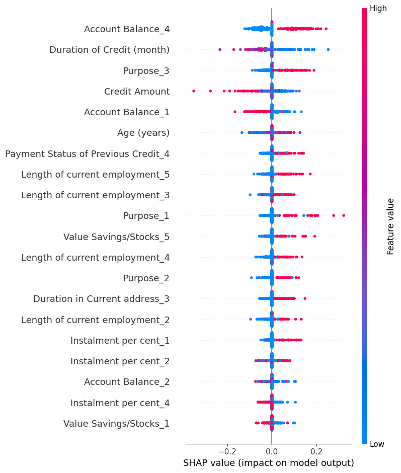

# 🔍 German Credit Risk Analysis with Explainable Deep Learning

This project demonstrates the application of **Explainable Artificial Intelligence (XAI)** in assessing creditworthiness using deep learning models. It combines predictive modeling with **global (SHAP)** and **individual (counterfactual)** explainability techniques to enhance transparency and trust in credit scoring decisions.

---

## 💼 Why This Matters

Traditional credit scoring models often function as "black boxes," leaving customers and financial institutions uncertain about decision-making processes. This project delivers a **transparent** and **interpretable** credit classification system, leveraging modern AI techniques aligned with ethical AI practices.

---

## 🎯 Objectives

- Build accurate credit risk classification models using deep learning (**MLP**, **CNN**).
- Address class imbalance with **SMOTE**.
- Apply **SHAP** for global explainability to identify key features driving credit approval.
- Generate **counterfactual explanations** to illustrate how individual applicants can improve credit outcomes.

---

## 🧠 Models Used

| Model            | Description                              |
|------------------|------------------------------------------|
| **MLP (Neural Net)** | Baseline feedforward neural network   |
| **CNN**          | 1D convolutional model on tabular input |

All models were trained on a **preprocessed German Credit Dataset** using **TensorFlow/Keras**.

---

## ⚖️ Handling Imbalanced Data

Utilized **SMOTE (Synthetic Minority Oversampling Technique)** to balance the dataset before training, ensuring fairer evaluation across credit classes.

---

## 🧪 Explainability Approach

### ✅ Global Explainability (SHAP)
- Employed **SHAP (SHapley Additive exPlanations)** to reveal overall feature importance.
- Identified top drivers of credit decisions, such as `Age`, `Credit Amount`, and `Duration`.

### ✅ Counterfactual Explanations
- Generated **manual counterfactuals** by perturbing inputs and observing output changes.
- Example: Adjusting `employment length` or `credit amount` to flip a decision from "reject" to "approve."

---

## 📈 Key Results

| Metric         | MLP Model | CNN Model |
|----------------|-----------|-----------|
| **Accuracy**   | 77.3%     | 80.1%     |
| **F1 Score**   | 0.76      | 0.79      |
| **Precision**  | 0.78      | 0.81      |
| **AUC-ROC**    | 0.83      | 0.85      |

---

## 📸 Visual Outputs

### SHAP Feature Importance

### Counterfactual Sample Example

---

## 📂 Project Structure

---

## ✅ Ideal For

- Organizations and individuals seeking **real-world applications** of AI in finance.
- Teams prioritizing **model transparency and fairness**.
- Data scientists exploring **SHAP and counterfactuals** in deep learning.

---

## 👨‍💻 Author

**Samson Orodele**  
- **Email**: [samorodele@gmail.com](mailto:samorodele@gmail.com)  
- **GitHub**: [github.com/SamsonOrodele](https://github.com/SamsonOrodele)  

---

## 📜 License

This project is licensed under the **MIT License** – feel free to use, modify, and extend it.

---
